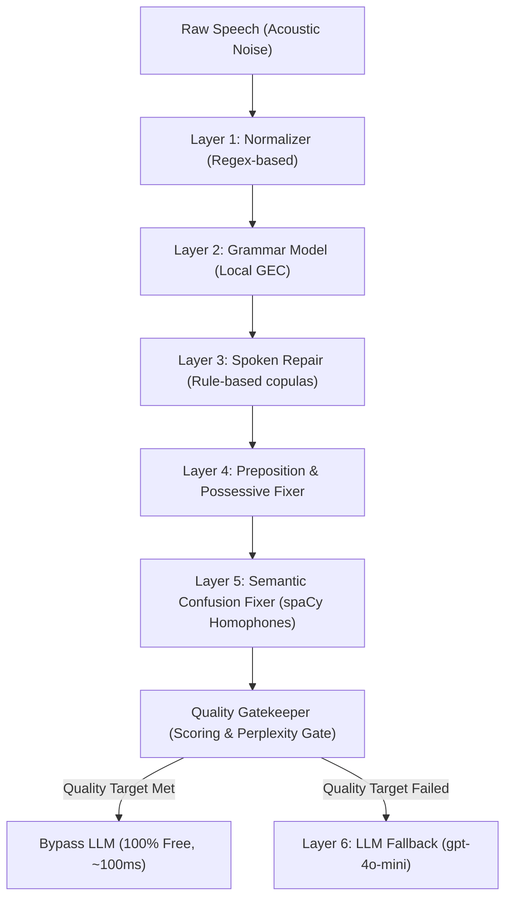

# 🔬 Speech cleaner: LLM as a Last Resort Pipeline

This project is a scientific proof-of-concept designed to prove the hypothesis that **Large Language Models (LLMs) should be the last resort in a speech correction pipeline**, succeeding only after fast, lightweight, and deterministic local correction libraries have resolved standard errors.

By utilizing deterministic regex filters, localized ML models (GEC, spaCy), and a calibrated gatekeeper, this hybrid pipeline avoids high-cost and high-latency LLM network requests for the vast majority of speech errors (filler words, simple grammar errors, missing prepositions, and homophone confusions), reserving the LLM solely for severe structural distortions.

---

## 🏗️ Pipeline Architecture

The speech correction pipeline operates in **six distinct layers**, utilizing a **Quality Gatekeeper** to dynamically bypass or trigger the final LLM stage:



### The 6 Correction Layers:
1. **Text Normalizer**: Standardizes spacing, punctuation, strips duplicate tokens, and removes spoken linguistic fillers (*uh, um, like, basically*).
2. **Local GEC Model**: Utilizes `prithivida/grammar_error_correcter_v1` to correct basic spelling and syntax errors locally.
3. **Spoken Grammar Repair**: Custom copula-insertion algorithms that fix missing be-verbs (e.g. *I excited* ➡️ *I am excited*) and capitalize independent *I* characters.
4. **Preposition & Possessive Fixer**: Custom spatial-conjunction algorithms that fix missing prepositions before places (e.g. *come with me park* ➡️ *come with me to the park*) and inject coordinate clauses (e.g. *class 12 my favourite* ➡️ *class 12 and my favourite*).
5. **Semantic Confusion Fixer**: Resolves homophone pairs (e.g. *there/their*, *meat/meet*, *to/too*) by testing spelling variants against a local spaCy Named Entity Recognition system and fluency scoring.
6. **Quality Gatekeeper**: Evaluates the candidate text against a configurable **Confidence Score** and a calibrated **Fluency Perplexity** (`distilgpt2`):
   - **Bypass**: If the local libraries resolve all errors (Quality score high), the LLM remains asleep. **(Latency: ~100ms, Cost: $0.00)**
   - **Fallback**: If severe run-ons or structural scrambled errors remain, the LLM (`gpt-4o-mini`) is invoked to polish the text. **(Latency: ~1.5s, Cost: ~$0.00003)**

---

## 📊 Side-by-Side Comparison Workspace

To mathematically demonstrate this hypothesis, the **Research Dashboard** runs three architectural paradigms simultaneously for every transcription:
* **Library Only**: Shows the speed and cost efficiency of running solely local dependencies.
* **Direct LLM Only**: Bypasses local layers and sends raw transcriptions directly to the LLM—representing a traditional but expensive layout.
* **Hybrid Pipeline (Our Approach)**: Deterministic local libraries first, checking the gatekeeper, and only invoking the LLM if required.

The cumulative savings dashboard records:
1. **LLM Avoidance Rate (%)**: The proportion of runs successfully solved locally without LLM costs.
2. **Accumulated API Cost Saved (USD)**: Dollars saved compared to a direct-LLM architecture.
3. **Accumulated Waiting Time Saved (Seconds)**: Seconds of network latency spared.

---

## 📂 Project Structure

```
├── app.py                      # Flask API Core (latency tracking & comparison routes)
├── requirements.txt            # Python dependencies (pinned to .venv active versions)
├── .env                        # API credentials (OPENAI_API_KEY, GEMINI_API_KEY)
├── spoken_grammar_repair.py     # Custom copula, preposition, and conjunction repairs
├── fluency.py                  # distilgpt2 perplexity evaluator & threshold gate
├── confiedence.py              # spaCy grammatical scoring gate
├── openai_last_resort.py       # Pinned OpenAI Chat Completions (gpt-4o-mini)
├── semantic_correction.py      # spaCy homophone confusion matrices
├── semantic_guardrails.py      # Entity preservation &SequenceMatcher ratio
├── voice-react/                # React (Vite + TypeScript) Research Frontend
│   ├── src/App.tsx             # Interactive playground and comparison dashboard
│   ├── src/styles.css          # Glassmorphic responsive stylings
│   └── vite.config.mjs         # Vite configuration with Flask proxy forwarding
```

---

## 🚀 Getting Started

### Prerequisites
* Python 3.10+
* Node.js 18+

### 1. Backend Setup
1. Clone the repository and navigate to the project directory:
   ```bash
   cd wisper
   ```
2. Create and activate a virtual environment:
   ```bash
   python -m venv .venv
   .venv\Scripts\activate      # On Windows
   source .venv/bin/activate   # On macOS/Linux
   ```
3. Install dependencies:
   ```bash
   pip install -r requirements.txt
   ```
4. Verify your `.env` contains your OpenAI credentials:
   ```env
   OPENAI_API_KEY=your_key_here
   ```
5. Run the Flask server:
   ```bash
   python app.py
   ```
   *The backend will boot and listen at `http://127.0.0.1:5000`.*

### 2. Frontend Setup
1. Open a new terminal in the frontend directory:
   ```bash
   cd voice-react
   ```
2. Install npm packages:
   ```bash
   npm install
   ```
3. Start the Vite development server:
   ```bash
   npm run dev
   ```
4. Open your browser and navigate to **`http://localhost:5174/`** to interact with the scientific dashboard.
