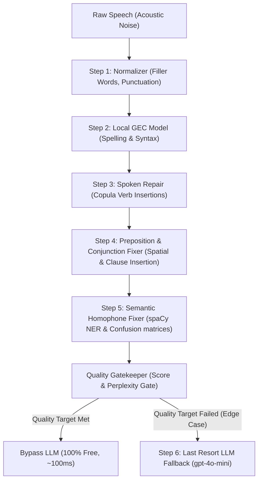

# 🔬 Post-Correction System: Step-by-Step Text Correction & Intelligent LLM Routing

An ultra-efficient, step-by-step post-processing system for Speech-to-Text transcriptions. 

Built for high-volume conversational applications, this system processes raw transcripts through a progressive, multi-stage local correction pipeline—resolving the vast majority of spoken errors (filler words, homophones, missing prepositions, and grammatical slips) for free. The costly LLM API is utilized **strictly for syntactic edge cases** that local processing stages cannot confidently resolve.

---

## 🛠️ The Step-by-Step Correction Pipeline

The system processes transcriptions progressively across **six sequential stages**, evaluating text quality at the gate before deciding whether to invoke the LLM fallback:



### Stage 1: Linguistic Normalization (Local)
Cleans conversational filler words (*uh, um, like, basically*), removes duplicate repeated words, and standardizes spacing and terminal punctuation.

### Stage 2: Local GEC Model (Local Checkpoint)
Applies fast, localized sequence-to-sequence spelling and grammatical error corrections using the lightweight `prithivida` spelling checkpoint.

### Stage 3: Spoken Grammar Repair (Linguistic Rules)
Repairs spoken copula omissions (e.g. *I excited* ➡️ *I am excited*, *my name Raj* ➡️ *my name is Raj*) and capitalizes independent *I* tokens.

### Stage 4: Preposition & Conjunction Fixer (Linguistic Rules)
Repairs omitted prepositions before common places (e.g. *come with me park* ➡️ *come with me to the park*) and injects logical spoken coordinate clauses (e.g. *class 12 my favourite* ➡️ *class 12 and my favourite*).

### Stage 5: Semantic Homophone Fixer (spaCy)
Resolves phonetically confused word pairs (e.g. *their/there*, *meet/meat*, *to/too*) by comparing word substitutions against local Named Entity Recognizers (NER) and language fluency metrics.

### Stage 6: The Quality Gatekeeper
Evaluates the candidate text against a configurable **Confidence Score** and a **Fluency Perplexity** (`distilgpt2`):
* **Bypass (Standard Case)**: If all previous steps resolve the transcript's errors (Quality score high), the LLM remains asleep. **(Latency: ~100ms, Cost: $0.00)**
* **LLM Fallback (Edge Case)**: If structural run-ons, severe syntax anomalies, or logical fragments remain, the gatekeeper flags the transcript as an **edge case** and routes it to `gpt-4o-mini` for final polishing. **(Latency: ~1.5s, Cost: ~$0.00003)**

---
## 📂 Project Structure

```
├── app.py                      # Flask API Core (latency tracking & comparison routes)
├── requirements.txt            # Python dependencies (pinned to .venv active versions)
├── .env                        # API credentials (OPENAI_API_KEY, GEMINI_API_KEY)
├── spoken_grammar_repair.py     # Custom copula, preposition, and conjunction repairs
├── fluency.py                  # distilgpt2 perplexity evaluator & threshold gate
├── confiedence.py              # spaCy grammatical scoring gate
├── openai_last_resort.py       # Pinned OpenAI Chat Completions (gpt-4o-mini)
├── semantic_correction.py      # spaCy homophone confusion matrices
├── semantic_guardrails.py      # Entity preservation & SequenceMatcher ratio
└── voice-react/                # React (Vite + TypeScript) Research Frontend
    ├── src/App.tsx             # Interactive playground and comparison dashboard
    ├── src/styles.css          # Glassmorphic responsive dashboard stylings
    └── vite.config.mjs         # Vite configuration with Flask proxy forwarding
```

---

## 🚀 Getting Started

### 1. Backend Setup
1. Activate your virtual environment and install dependencies:
   ```bash
   # Activate your virtual environment
   .venv\Scripts\activate
   
   # Install pinned packages and local spaCy models automatically
   pip install -r requirements.txt
   ```
2. Verify your `.env` contains your OpenAI credentials:
   ```env
   OPENAI_API_KEY=your_key_here
   ```
3. Run the Flask server:
   ```bash
   python app.py
   ```
   *The backend will boot and listen at `http://127.0.0.1:5000`.*

### 2. Frontend Setup
1. In a new terminal, navigate to the React directory:
   ```bash
   cd voice-react
   ```
2. Install npm packages and start the dev server:
   ```bash
   npm install
   npm run dev
   ```
3. Open your browser and navigate to **`http://localhost:5174/`** to run live speech test cases.
